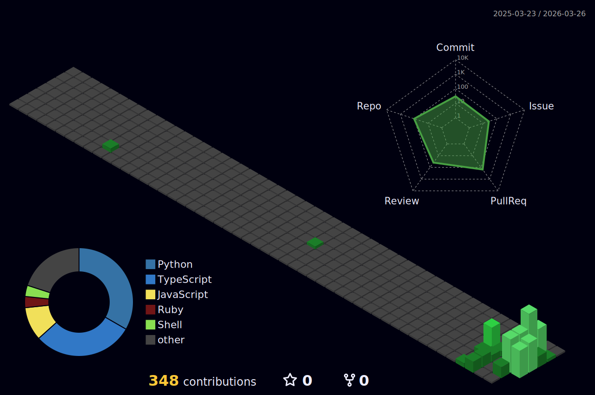

&nbsp;
&nbsp;

 

 

<!-- ═══════════════════════ ABOUT + CONTRIBUTIONS (TWO COLUMNS) ═══════════════════════ -->

<table>
<tr>
<td width="55%" valign="top">

### 🧠 About Me

🤖 &nbsp; Building **autonomous AI systems** — multi-agent orchestration, RAG pipelines, and graph intelligence that run 24/7

🏗️ &nbsp; Founder of **[The Foundry PHL](https://thefoundryphl.com)** — nonprofit empowering young founders on the East Coast

🎓 &nbsp; Studying **Computer Science** at **Drexel University**

🔬 &nbsp; Shipping research to production — ReAct, Self-RAG, Constitutional AI

 

### ⚡ Tech Stack

 

</td>
<td width="45%" valign="top">

### 📈 Contributions

 

</td>
</tr>
</table>

 

 

<!-- ═══════════════════════════════ PROJECTS ═══════════════════════════════ -->

### 🚀 What I've Built

<table>
<tr>
<td width="50%" valign="top">

#### [aegis](https://github.com/JiwaniZakir/aegis)
Self-hosted personal intelligence platform. Aggregates 15+ data sources with RAG-powered insights and autonomous content generation.

 
`Python` `FastAPI` `pgvector` `Celery`

</td>
<td width="50%" valign="top">

#### [Partnerships_OS](https://github.com/JiwaniZakir/Partnerships_OS)
Enterprise partnership intelligence with Neo4j knowledge graph, voice-first AI agent, and Notion-synced CRM.

 
`TypeScript` `Neo4j` `Next.js` `React Native`

</td>
</tr>
<tr>
<td width="50%" valign="top">

#### [sentinel](https://github.com/JiwaniZakir/sentinel)
AI-powered Slack bot for community management. GPT-4 research pipeline, automated onboarding, human-in-the-loop outreach.

 
`Node.js` `Slack Bolt` `GPT-4` `Prisma`

</td>
<td width="50%" valign="top">

#### [lattice](https://github.com/JiwaniZakir/lattice)
Adaptive multi-agent orchestration with learned routing, hierarchical planning, and Z3 workflow verification.

 
`Python` `PyTorch` `Z3` `OpenTelemetry`

</td>
</tr>
<tr>
<td width="50%" valign="top">

#### [evictionchatbot](https://github.com/JiwaniZakir/evictionchatbot)
EVITA: AI legal assistant helping tenants facing eviction. Built with Philadelphia Legal Assistance.

 
`React` `OpenAI` `Tailwind` `Vercel`

</td>
<td width="50%" valign="top">

#### [spectra](https://github.com/JiwaniZakir/spectra)
RAG evaluation toolkit implementing 12 retrieval strategies with A/B testing and Pareto-optimal pipeline selection.

 
`Python` `FAISS` `Optuna` `Streamlit`

</td>
</tr>
</table>

 

 

<!-- ═══════════════════════════ OPEN SOURCE ═══════════════════════════ -->

### 🌐 Open Source Contributions

 

&nbsp;

&nbsp;

  

&nbsp;

&nbsp;

  

| Domain | What I Contribute |
|:------:|:-----------------|
| 🤖 **AI/ML** | Multi-agent frameworks, RAG pipelines, LLM evaluation, embedding systems |
| 🔧 **Backend** | FastAPI/Fastify services, async task queues, event-driven architectures |
| 🕸️ **Graph** | Neo4j knowledge graphs, pgvector semantic search, relationship modeling |
| 🛡️ **Security** | Zero-trust patterns, AES-256-GCM encryption, SOPS secrets management |
| 🏗️ **Infra** | Docker orchestration, Traefik, Cloudflare Tunnels, GitHub Actions CI/CD |

 

 

<!-- ═══════════════════════════════ FOOTER ═══════════════════════════════ -->

