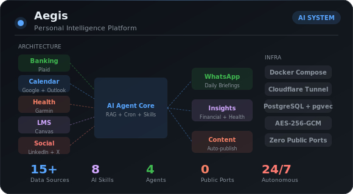
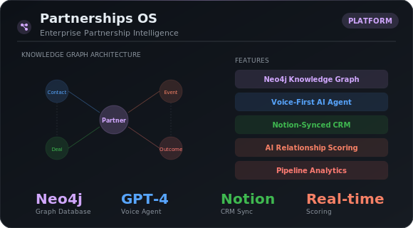
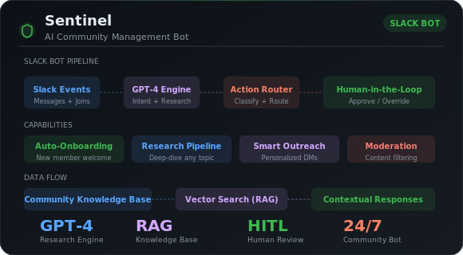
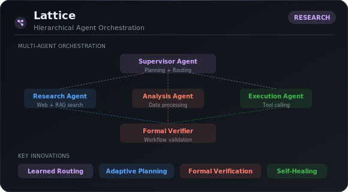
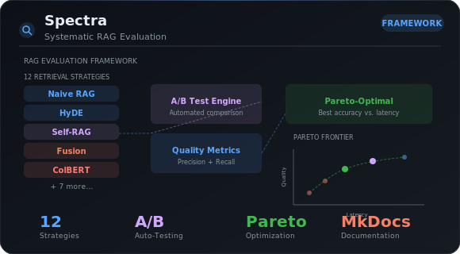

&nbsp;
&nbsp;

 

<table>
<tr>
<td width="55%" valign="top">

### About

Building **autonomous AI systems** — multi-agent orchestration, RAG pipelines, and graph intelligence that run 24/7

Founder of **[The Foundry PHL](https://thefoundryphl.com)** — nonprofit empowering young founders on the East Coast

Studying **Computer Science** at **Drexel University**

 

### Tech Stack

**Languages** &nbsp;

**AI / ML** &nbsp;

**Backend** &nbsp;

**Data** &nbsp;

**Infra** &nbsp;

</td>
<td width="45%" valign="top">

### Stats

 

 

</td>
</tr>
</table>

 

### What I've Built

 

&nbsp;

&nbsp;

&nbsp;

 

### Open Source Contributions

*Bug fixes and features across major AI/ML projects*

 

| Project | Stars | PRs |
|---------|:-----:|-----|
| [**LangChain**](https://github.com/langchain-ai/langchain) · LLM application framework | ⭐ 132K | [#35556](https://github.com/langchain-ai/langchain/pull/35556) · [#35528](https://github.com/langchain-ai/langchain/pull/35528) · [#35484](https://github.com/langchain-ai/langchain/pull/35484) |
| [**LiteLLM**](https://github.com/BerriAI/litellm) · Universal LLM API | ⭐ 42K | [#23346](https://github.com/BerriAI/litellm/pull/23346) |
| [**Poetry**](https://github.com/python-poetry/poetry) · Python dependency management | ⭐ 34K | [#10767](https://github.com/python-poetry/poetry/pull/10767) |
| [**GraphRAG**](https://github.com/microsoft/graphrag) · Microsoft graph RAG | ⭐ 32K | [#2262](https://github.com/microsoft/graphrag/pull/2262) |
| [**LangGraph**](https://github.com/langchain-ai/langgraph) · Multi-agent orchestration | ⭐ 28K | [#7013](https://github.com/langchain-ai/langgraph/pull/7013) |
| [**Cognee**](https://github.com/topoteretes/cognee) · Knowledge graph memory | ⭐ 15K | [#2263](https://github.com/topoteretes/cognee/pull/2263) |
| [**DeepEval**](https://github.com/confident-ai/deepeval) · LLM evaluation | ⭐ 14K | [#2527](https://github.com/confident-ai/deepeval/pull/2527) |

 

<picture>
  <source media="(prefers-color-scheme: dark)" srcset="https://raw.githubusercontent.com/JiwaniZakir/JiwaniZakir/output/github-contribution-grid-snake-dark.svg">
  <source media="(prefers-color-scheme: light)" srcset="https://raw.githubusercontent.com/JiwaniZakir/JiwaniZakir/output/github-contribution-grid-snake.svg">
  
</picture>

